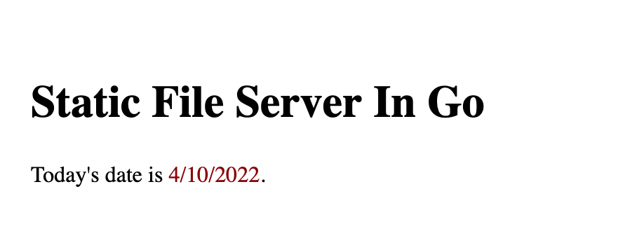

# A Tale of Two FileSystems in Go
<figure>

<figcaption>Don't let web security scare the Dickens out of you!!</figcaption>
</figure>

## Using embedding and a few tricks to keep your static files secure with fs.FS

I'm currently working on a project to make it easier to integrate javascript code into Go-based web server projects. It's called [vite-go](https://github.com/torenware/vite-go), and it's implemented as a Go module.

As part of my work on the module, I kept running up on some of the oddities of Go's post-v1.16 file APIs. In 1.16, Go introduced a couple of new concepts:

* A new technique for building static files like templates into your applications, to make it easier to distribute them. This is called embedding, and it uses a syntax like this:

```golang
//go:embed my-files
var myFiles embed.FS

```

* A new file system interface, which `embed` uses, but you can also use with regular directories:

```golang
myFiles := os.DirFS("my-files")
```

These two different uses of the `fs.FS` interface are very similar, but *not* identical. Which is what this article will tell you. Because you need to understand the differences -- including some security implications.

So why write about this now, since Go 1.18 is just out? Because the 1.16 interfaces are the latest file system interfaces, but there aren't many tutorials discussing them in detail. I hope to fix that here.

## Using fs.FS to Operate on Files

The first thing we need to understand about the 1.16 style of file systems? We need to understand what they're good for.  This might not be obvious at first. Go likes to do things using interface definitions. Here's `fs.FS`'s definition, and note how simple it is, straight from the docs:

```golang
type FS interface {
	// Open opens the named file.
	//
	// When Open returns an error, it should be of type *PathError
	// with the Op field set to "open", the Path field set to name,
	// and the Err field describing the problem.
	//
	// Open should reject attempts to open names that do not satisfy
	// ValidPath(name), returning a *PathError with Err set to
	// ErrInvalid or ErrNotExist.
	Open(name string) (File, error)
}
```

What?

How can you even use this? All the interface promises to do is give you an `Open()` method. AND NOTHING ELSE?

If you've used Go for a while, you're used to objects having a lot of object oriented-type methods. So what are you do do with an object that Opens, and nothing else?

The solution Go 1.16 comes up with is to use a sort of [Adapter pattern](https://en.wikipedia.org/wiki/Adapter_pattern), and give you a set of functions that know how to make an `fs.FS` object do things that are actually useful:

```golang
fSys := os.Dir("my-files")

// Want to read my-files/list.txt?
contents, err := fs.ReadFile(fSys, "list.txt")

// Read the directory?
items, err := fs.ReadDir(fSys, ".")
if err != nil {
    // handle the error...
}
for _, item := range items {
    fmt.Println(item.Name())
}

// Go Globbing for files?
matches, err := fs.Glob(fSys, "*.txt")
if err != nil {
    // guess we would bail here
}
for _, path := range matches {
    fmt.Println(path)
}

``` 

Serving files from this directory using the `http.FileServer()` function looks something like this:

```golang
	filesDir := os.DirFS("my-files")

	handler := http.FileServer(http.FS(filesDir))
	http.Handle("/", handler)

	log.Println("Serving static files at :5000")
	err := http.ListenAndServe(":5000", handler)
	if err != nil {
		log.Fatal(err)
	}

```

`http.FS()` is an adaptor that we need for `http.FileServer`, which wants to take an `http.FileSystem` object; `http.FS()` does the conversion.

You'd think that since embed.FS and os.DirFS() share this same fs.FS interface, that you'd be able to use them exchangably here.  But sadly: YOU'D BE WRONG :-)

## So What's the Difference

This is where we get into my [`vite-go`](https://github.com/torenware/vite-go) project.  For my library to give you access to files from a javascript project -- typically from Vue 3, although the library supports React as well -- either you need to serve up your static files yourself, or conveniently, use my bundled file server. I implemented the bundled solution for a simple reason: I kept shooting myself in my extremities, and so I wrote something less error prone.

What kind of errors, you ask?

The first difference is that `os.DirFS('my-files')` effectively sets the "current directory" to `my-files/`.  `embed.FS`? Nope. Let's suppose that my directory has these files and sub-directories:

```shell
$ tree -a my-files
my-files
├── .configs
│   └── oh-no-i-am-served.txt
├── .env
├── Ergosign-Carnival-Clown-costume.ico
├── css
│   └── styles.css
├── index.html
├── js
│   └── index.js
└── subdir
    └── index.html
``` 

If I use `fs.ReadDir()` on `os.DirFS('my-files')`, I get the following list:

```shell
$ go run main.go
 .configs/
     oh-no-i-am-served.txt
 .env
 Ergosign-Carnival-Clown-costume.ico
 css/
     styles.css
 index.html
 js/
     index.js
```
 
This lists *all* the files from the `my-files` directory, including files we really don't won't to expose to the world, like `.env` (frequently containing sensitive info), or from the `.configs` directory, which looks pretty dicey as well :-( Using my web browser on port 5000,

```
// http://localhost:5000/.env

SECRET=oops-I-am-revealed
```

Can't go live with that, no we can't!

So how does `embed.FS` handle this? It's good news and bad news:

The good news is that our dot files are now hidden:

```
$ go run main.go
 files/
     Ergosign-Carnival-Clown-costume.ico
     css/
         styles.css
     index.html
     js/
         index.js
``` 

The bad news is that we are now in the parent directory. This is [a feature, and not a bug](https://github.com/golang/go/issues/43431), since `embed.FS` is designed to let you embed multiple files and directories in the same directive. Is this great? Arguably not. Is it intentional? It absolutely is.

So if you browse to `http://localhost:5000`, you see

```
// http://localhost:5000

my-files/

```

and not the index page, which is sitting at `my-files/index.html`.

The fix for this is to "adjust" the current directory when you use an embedded file system, as so:

```golang
	filesDir := myFiles

	// we need to adjust where the "top"
	// of the file system is, as so:
	adjustedDir, err := fs.Sub(filesDir, "files")
	if err != nil {
		log.Fatal(err)
	}

	handler := http.FileServer(http.FS(adjustedDir))
	http.Handle("/", handler)

```

Instead of seeing the file list, we now see the actual index page:



<hr>

## It Works. What About Security?

Now that we can hook up our `fs.FS` file systems, there are at least two security related issues to worry about:

1. dot files and other files or directories we want hidden.
2. Listing directories, which is typically considered A Bad Thing, although `http.FileServer` does it anyway.

Alex Edwards, the guy who wrote the very useful guide to writing web apps in Go, [Let's Go](https://lets-go.alexedwards.net/), also wrote [an excellent article about this in 2018](https://www.alexedwards.net/blog/disable-http-fileserver-directory-listings), before Go 1.16 came out. It's still very much worth your time to read it. I've adapted Alex's approach to use the more modern 1.16+ APIs and have the code up on the repo I'll post with this article.

There are several things you can do to make serving static files more secure:

* Use the `embed.FS` approach, and use it correctly. As an example, this is secure:

```
//go:embed files
var securedFiles embed.FS
```

and this here, which you should *never* do, is every bit as insecure as the os.DirFS approach:

```
// NEVER DO THIS:
//go:embed files/*
var seeThemAll embed.FS
```

* To hide directories, you can use Alex Edward's approach, which you can adapt to `fs.FS` file systems like this:

```golang
// To block access to directory listings, wrap our file system
// with another filesystem that blocks them.

type FilteringFS struct {
	fs fs.FS
}

// And make the wrapper into an fs.FS by implementing its
// interface.
func (wrapper FilteringFS) Open(name string) (fs.File, error) {
	f, err := wrapper.fs.Open(name)
	if err != nil {
		return nil, err
	}

	s, err := f.Stat()
	if err != nil {
		return nil, err
	}

	if s.IsDir() {
		// Have an index file or go home!
		index := filepath.Join(name, "index.html")
		if _, err := wrapper.fs.Open(index); err != nil {
			closeErr := f.Close()
			if closeErr != nil {
				return nil, closeErr
			}

			return nil, err
		}
	}

	return f, nil
}
```

To use this, we just create the typed wrapper file system, and we can pass it to `http.FileServer` as well:

```golang
	filteredDir := FilteringFS{
		fs: myFiles,
	}
	handler := http.FileServer(http.FS(filteredDir))
	http.Handle("/", http.StripPrefix("/", handler))

```

* This is a complete solution, but sometimes you can't use `embed.FS`, since it means the directory you need to serve must exist at build time. For my project, I can't do this in all cases. This means I need to fix the security holes you get with `os.DirFS`. There are two approaches, both in my accompanying repo:
    1. Write middleware that filters by file name, similar to Alex's article.
    2. Or, you can take the file system wrapper approach, and add that filtering logic to that code instead.

Use whatever approach meets your needs for both convenience and security.  

